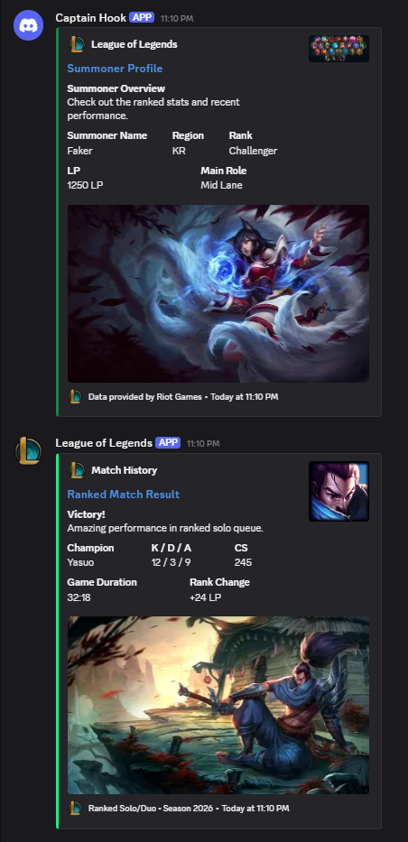

<p align="center"><a href="https://refactoring.guru/design-patterns/builder" target="_blank"></a></p>

# Builder Pattern – PHP Example

This repository demonstrates a **clean and correct implementation of the Builder Design Pattern** using **pure PHP** without any frameworks.

The example is intentionally simple and educational, focusing on _design thinking_ rather than tooling.

## Test with docker

```bash
docker compose run --rm php php ./App/index.php
```

## Screenshot


